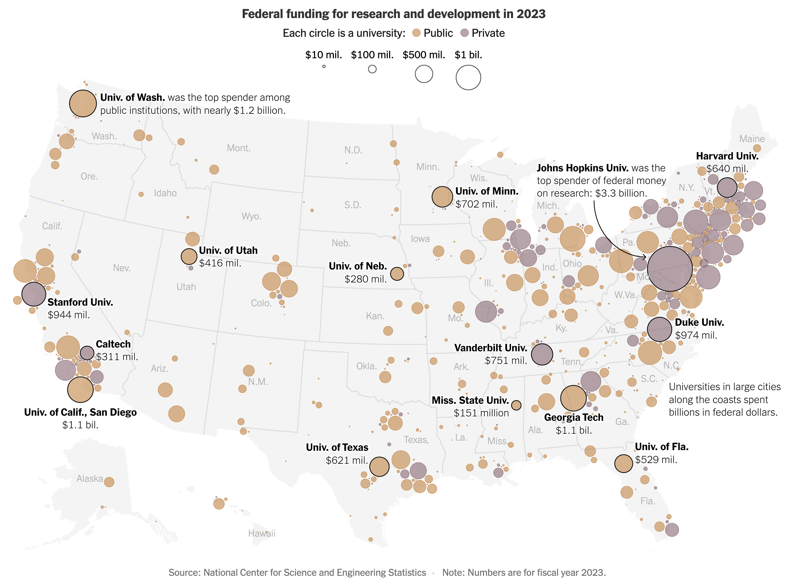

# Federal Funding to Universities in the U.S. 2023

This repository contains code in R to replicate the following graphic:

  

## Source

- Title: **Where Federal Dollars Flow to Universities**

- Author(s): Andrea Fuller, Zach Levitt and Isabelle Taft

- Date: Apr 30, 2025

- From: New York Times

- URL:
  <https://www.nytimes.com/interactive/2025/04/30/us/university-funding-research.html>

- PDF:
  [University-Funding-Research-NYT.pdf](source/University-Funding-Research-NYT.pdf)

## Data

There are 2 data files:

- Excel: `nsf25314-tab024.xlsx`

- CSV: `highered-geo-type-nsf25314-tab024.csv`

  

The source of the federal funding data is the *Higher Education Research
and Development (HERD) Survey* from 2023.

Specifically, the data (in the excel file) comes from Table 24:
*Federally financed higher education R&D expenditures, ranked by FY 2023
R&D expenditures: FYs 2010–23*.

URL:
<https://ncses.nsf.gov/surveys/higher-education-research-development/2023#data>

  

Geospatial coordinates (longitude and latitude), as well as type of
university (e.g. public or private) are available in the CSV file
`highered-geo-type-nsf25314-tab024.csv`. This is a curated file obtained
through queries to ChatGPT-4.
